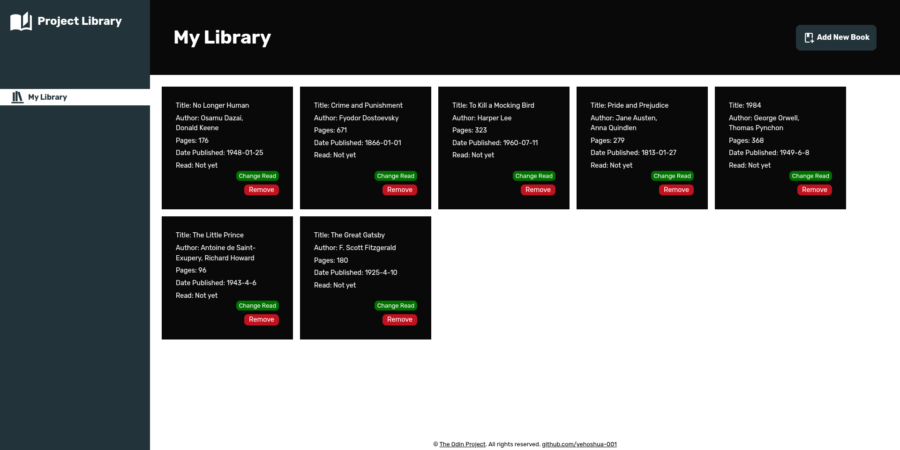

# Project: Library | The Odin Project 

## Description 
This project is a web-based library that stored books information in an array which can be displayed. The purpose of this project is to demonstrate the lessons I learned in JavaScript Course in [Organizing Your JavaScript Code](https://www.theodinproject.com/lessons/node-path-javascript-library) module which includes Organizing Code with Objects and Objects Constructors.

<strong>Note:</strong> Since this project doesn't require any storage to save the information between reloads, it will only keep the "submitted" information in memory, therefore using a "preventDefault()" method for such event will prevent the form from sending the information to a server by default. The reason this project doesn't require any storage is that the purpose of this project is only to demonstrate how to make <em>object constructors</em> and accessing <em>object prototypes</em>.

## Sample Image

## Access
Method 1
- Access the project through its github-page: https://yehoshua-001.github.io/library/

Method 2
1. Clone the repository in your local computer.
2. Open the 'index.html' file in your web browser.

## Reference
Close button icon in dialog form &mdash; [Pictogrammers](https://pictogrammers.com/library/mdi/icon/close/)